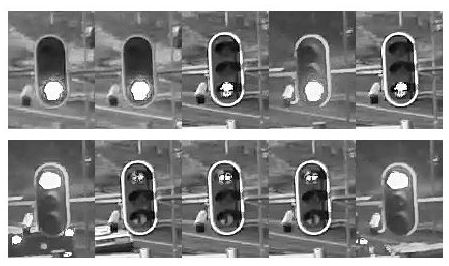
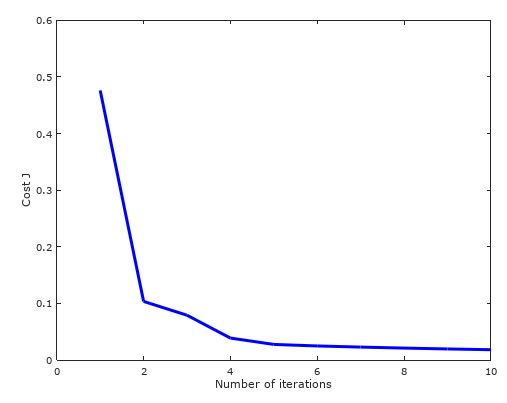

# Traffic Light Detection
This Octave/Matlab script can detect traffic light color analysing live stream.
It is trained by few already described samples. 

* Classification method: Logistic Regression
* Optimization: Gradient Descent 

## Note
- *Written only for educational purposes*
- *Intentionally written in pure Matlab language, using only elementary arithmetic operations:*

## Training samples

## Training efficiency

## Run
### Learn (optional)
* collect some training samples using [bin/collectSamples.bat](bin/collectSamples.bat)
* then put them to the respective directories under datasource/train/
* run [learn.m](learn.m) script in Matlab/Octave

### Test (optional)
* collect some test samples using [bin/collectSamples.bat](bin/collectSamples.bat)
* then put them to the respective directories under datasource/test/
* run [check.m](test.m) script

### Detect
* open live stream using [bin/startStream.bat](bin/startStream.bat) 
* run [detect.m](detect.m) script

### Requirements
* [VLC](http://www.videolan.org)
* [Octave](https://www.gnu.org/software/octave)

